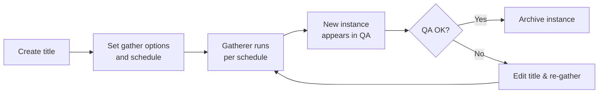

# Your first gather

In PANDAS, **gathering** (also known as web crawling) is how you capture and preserve a website. You begin by creating a
**title** for each site or page you want to archive. When PANDAS runs the gather job on schedule, it produces an
**instance**—a timestamped snapshot of that title at a specific moment. Each instance then appears in your QA worktray
for review. After you approve it, the instance is permanently archived; if you spot an issue, you edit the title and run
the gather again.

1. **Create a title**
    - From the PANDAS dashboard, click **Add website**.
    - In the **Seed URL** field, paste the full web address (e.g. `https://example.com`).
    - The **Name** field will auto-fill with the page’s title—edit as needed to clean it up.

2. **Metadata**
    
    - **Subjects**: Choose a few subject tags to describe the content. PANDAS may offer suggestions, ensure they're
      relevant before accepting.
    - **Collection**: If this website is part of an event or thematic collection add it. 
    - **Publisher**: Search for the site’s publisher.
        - If it exists, select it.
        - If not, click the **+** button to add one, choose a publisher type (e.g. Commercial, Government, Personal).

3. **Permissions**
    - Under **Collect under:** leave as **Legal deposit** (unless the publisher has granted archiving permissions).

4. **Configure Gather**
    - **What to collect:**
        - **All pages on website** – archives every page under the seed URL.
        - **Just this page** – archives only the single URL you entered.
        - **This page and the pages it links to** – archives the seed URL plus directly linked pages.
      - **Scheduling:**
        1. Under **Schedule**, choose how often to gather (e.g. Annually, Monthly).
        2. To start immediately, under **One-off**, leave date/time blank, and click **Add**.

5. **Save & Monitor Gather**
   - Click **Save**.
   - In the sidebar, open **Gather Queue** to see your job (and its progress).
   - If nothing appears, double-check that you added a **One-off** schedule.

6. **Quality Assurance**
   - Once the gather is complete, click **QA** in the sidebar.
   - Click the **This Gather** thumbnail to replay the archived pages.
   - If you're satisfied the site was archived succesfully, click button **Archive** in top-left.
   - If something went wrong you **Edit Title** and adjust the gather settings and schedule another one-off gather,
     then **Delete** the failed instance.
